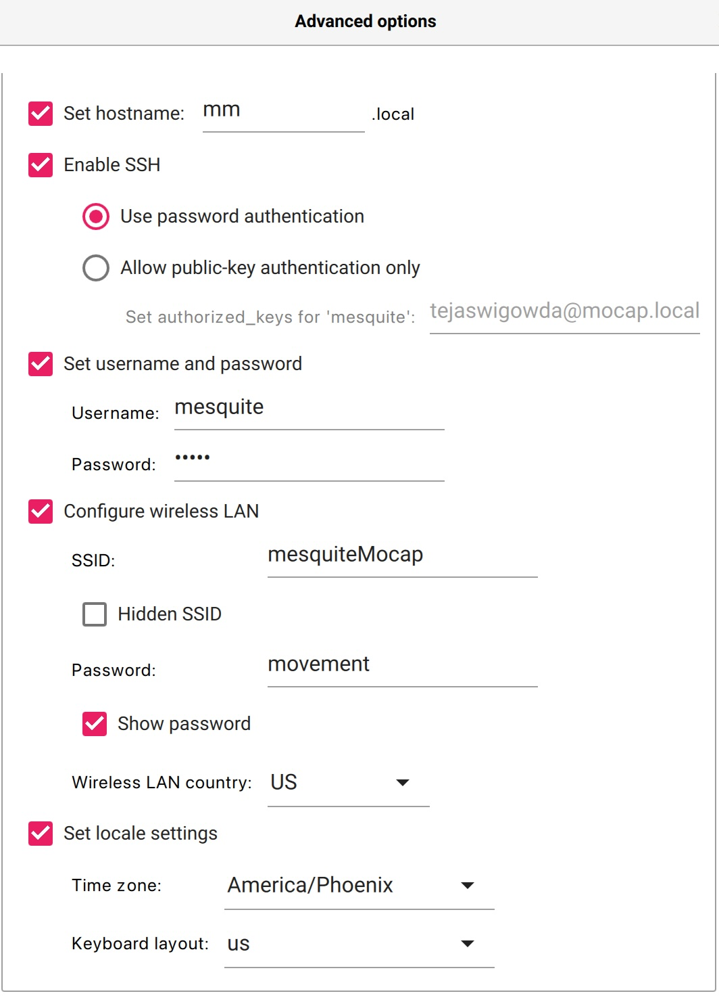

## Mesquite Mocap Dongle

### STEP 0: Hardware

Get a 
- [Raspberry Pi Zero](https://www.raspberrypi.com/products/raspberry-pi-zero/) (henceforth shortened as Pi Zero, Pi or rpi), and 
- a SD card (2gb should work, atleast 8gb recommended). Use these recommended options (will allow you to ssh intpo Pi to configure it):


### STEP 1: Installing Node.js and other necessary software on Pi Zero W

a. Flash a **terminal only** image of raspberry pi using [Pi OS Imager](https://www.raspberrypi.com/software/):




b. Ssh into pi from a bash shell
```
ssh mesquite@mm.local 
```

c. Then install node.js and other dependencies for your system: 

```
sudo apt update
sudo apt install nodejs npm git
```

### STEP 2: Install More Dependencies

a. Run  
```sh
sudo apt-get remove python3
sudo apt-get update
sudo apt-get install python2.7
sudo npm install n
sudo n install 6

```
in the rpi shell.


b. Make sure **serial interface** and **auto-logon for root user** are enabled (use `sudo rapsi-config`)


c. Add 
```
dtoverlay=dwc2
```
to `/boot/config.txt`.


d. Add 

```
dwc2
g_serial
```
to `/etc/modules`


### STEP 3: Finishing Up

To finish the Pi setup, we will put the `pi-ws-server-to-serial` onto your pi. This takes the streamed data from the Seeds and  converts it to serial data. This makes it much easier to aggregate the data onto any computer plugged into the pi. Go to the terminal on your Raspberry Pi and clone this repo:

```sh
git clone https://github.com/Mesquite-Mocap/pi-ws-server-to-serial.git
cd pi-ws-server-to-serial
sudo npm install serialport ws
```

To start the server on boot you will need to add

```sh
sudo node server.js

```
to your `~/.bashrc`.

